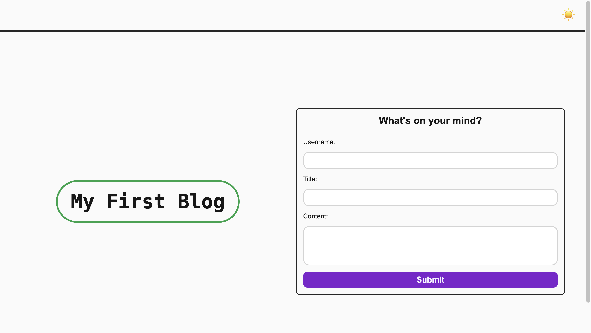
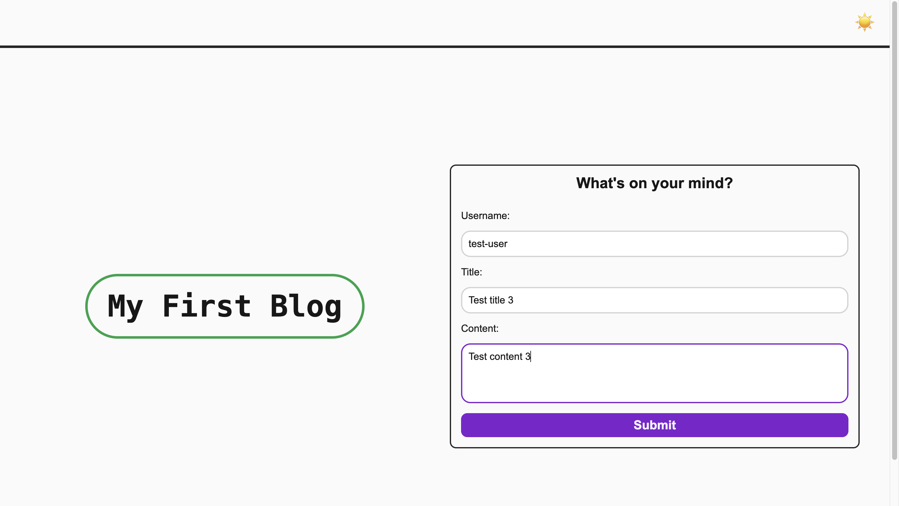
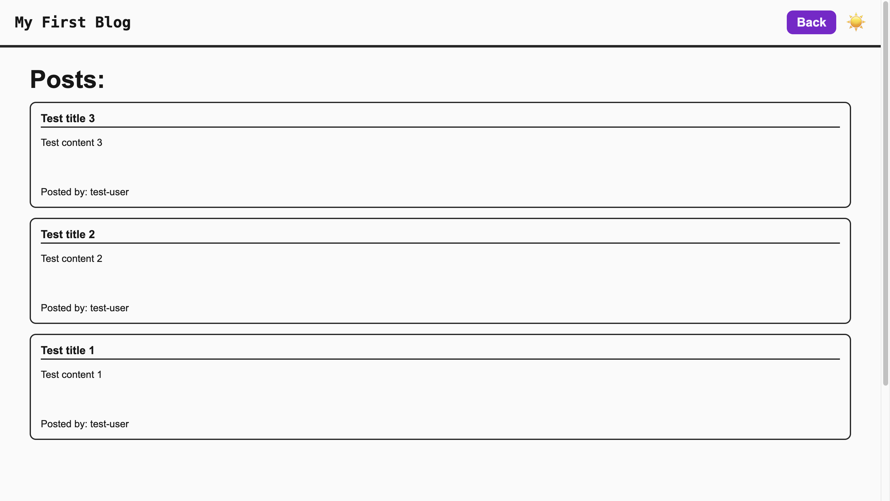
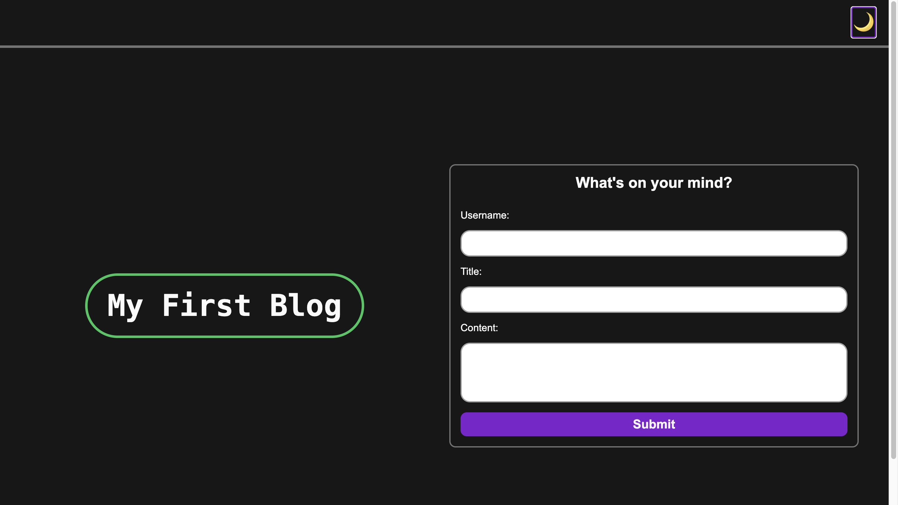

# Bootcamp-module-four-challenge

## Description

I created this project to practice my HTML, CSS and JavaScript skills. This project was fun, since I was able to see how each technology contributed to the website. HTML provided the structure of the website, CSS its styling and responsive design, and Javascript the interactivity to make the site function and make it store data in the local storage of the user. This was a great learning experience, since I got to practice all the knowledge that I have learned during the bootcamp so far, while also learning brand-new things like implementing a fully functional dark mode.

## Installation

For this project no installation is required. Just visit the site by clicking the following link: https://eduardovela2022.github.io/Bootcamp-module-four-challenge/

## Usage

- To start using this project you will need to go to the project’s homepage, by clicking the following link: https://eduardovela2022.github.io/Bootcamp-module-four-challenge/
  

- To upload a new post, you will need to fill out the form that appears in the website’s homepage. Then you will need to click on the form’s submit button to upload it.
  

- Once you have uploaded a brand-new post, using the form found on the website’s homepage, you will be redirected to the blog page, were you will find all the other posts that were previously uploaded by you. To go back to the homepage, you can click on the back button that now appears in the website’s header.
  

- To toggle the website’s dark mode or light mode, just click on the sun or moon icon that appears on the website’s header, both on the homepage and the blog page.
  
  

## Credits

For this project I used the following resources:

- Mozilla. (n.d.). Outline-style - CSS: Cascading style sheets: MDN. MDN Web Docs. https://developer.mozilla.org/en-US/docs/Web/CSS/outline-style

- Toptal Designers. (n.d.). HTML symbols, entities, characters and codes. HTML Arrows. https://www.toptal.com/designers/htmlarrows/

- W3Schools. (n.d.). CSS Forms. CSS forms. https://www.w3schools.com/css/css_form.asp

- W3Schools. (n.d.). CSS transitions. https://www.w3schools.com/css/css3_transitions.asp

- W3Schools. (n.d.). How to - redirect to another webpage. How To Redirect to Another Webpage. https://www.w3schools.com/howto/howto_js_redirect_webpage.asp

- Walsh, D. (2018, October 8). How to get and set CSS variable values with JavaScript. David Walsh Blog. https://davidwalsh.name/css-variables-javascript

## License

This project is under the MIT license.
